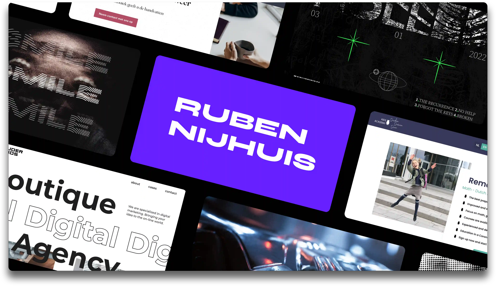

👋  Hi, my name is Ruben and I am a creative developer working in the visual space  👻

In my day-to-day life, I work on web and app development challenges at startups, create cool projects at Codam Coding College <a href="https://profile.intra.42.fr/users/rnijhuis">(42 Network)</a>, and write documentation and tools to make developing for developers easier.

Alongside coding, I love discovering the creative world by designing posters, creating 3D artwork, orchestrating house <a href="https://soundcloud.com/user-945766532-607674239">music mixes</a>, and exploring urban photography. You can find my work <a href="https://rubennijhuis.com/gallery">here →</a>

 

📬  <a href="mailto:contact@rubennijhuis.com">→ Send me an e-mail</a>

📸  <a href="https://instagram.com/ruben__nijhuis">→ Find me on instagram</a>

🕸  <a href="https://rubennijhuis.com">→ The internet cave</a>
